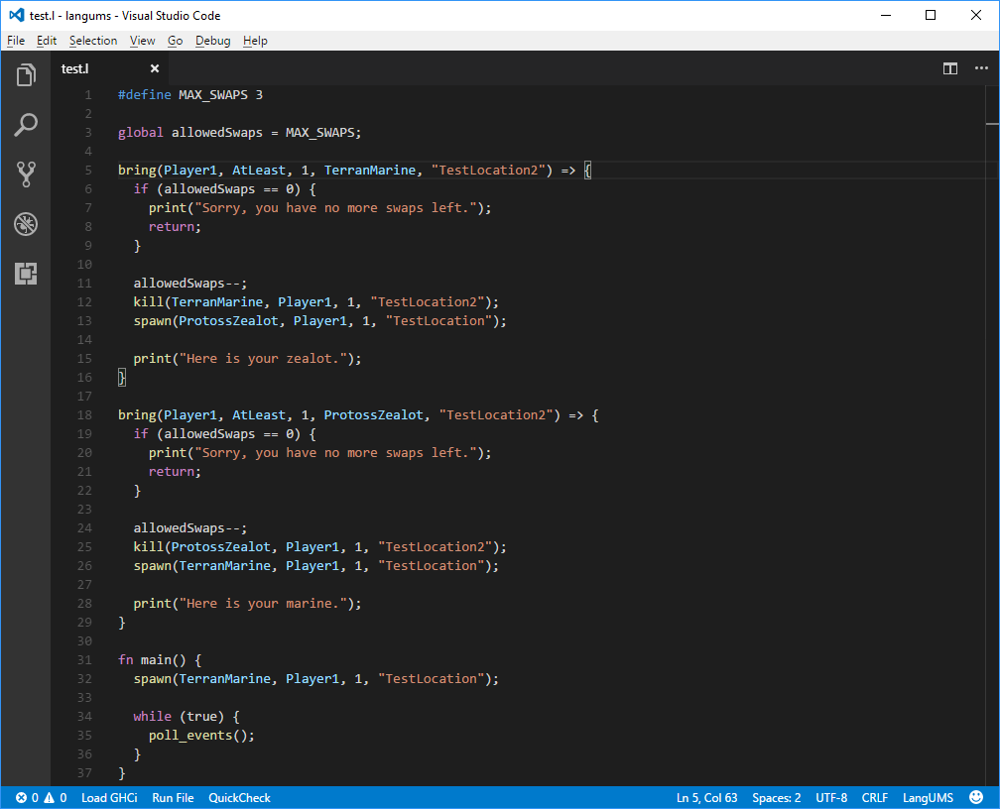
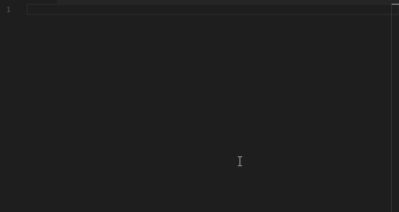

# LangUMS

Integration with LangUMS, a programming language for StarCraft: Brood War custom maps.

More info - https://github.com/langums/langums

## Features

* Syntax Highlighting on instrinsics

* Code Completion on intrinsics
* Snippets for intrinsic functions and conditions

* Detection of viable locations from a broodwar map
* Experimental debugger
